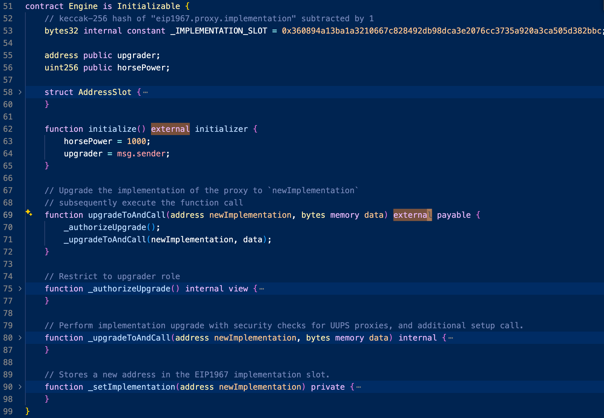

# Ethernaut Motorbike Solution (After Decun Upgrade)
Following the Decun upgrade, the `selfdestruct` opcode behavior has been modified (EIP-6780). This change means that the selfdestruct no longer removes the contract code from the blockchain, rendering the Motorbike challenge seemingly unsolvable. However, there is a new approach to tackle this, which we will outline in this write-up.

## The solution before the upgrade

> Ethernaut's motorbike has a brand-new upgradeable engine design.
>
> Would you be able to `selfdestruct` its engine and make the motorbike unusable?

### Analysis

Our goal is to `selfdestruct` the `Engine`. Let's look at it first.

There are only 2 external/public functions: `initialize` and `upgradeAndCall`. Since the `upgradeAndCall` function looks more interesting, let's examine it first.



#### `upgradeAndCall`

The function first calls `_authorizeUpgrade()`, which checks if `msg.sender == upgrader`. Therefore, we need to control `upgrader` to make it ourselves. There is only one place where we can control it: `initialize`. Let's examine it.

```solidity
// Upgrade the implementation of the proxy to `newImplementation`
// subsequently execute the function call
function upgradeToAndCall(address newImplementation, bytes memory data) external payable {
    _authorizeUpgrade();
    _upgradeToAndCall(newImplementation, data);
}

// Restrict to upgrader role
function _authorizeUpgrade() internal view {
    require(msg.sender == upgrader, "Can't upgrade");
}
```

#### `initialize`

The `initialize` function has an [`initializer` modifier](https://github.com/OpenZeppelin/openzeppelin-contracts/blob/v3.4.2/contracts/proxy/Initializable.sol#L36), which checks if the contract is initialized yet. In our case, it is not, so we can make the `upgrader` ourselves. Let us return to the `upgradeAndCall` function.

```solidity
function initialize() external initializer {
    horsePower = 1000;
    upgrader = msg.sender;
}
```

```solidity
contract Initializable {
  bool private initialized;
  // [...]
  modifier initializer() {
    require(_initializing || _isConstructor() || !_initialized, "Initializable: contract is already initialized");
  }
  // [...]
}
```

```shell
# check if it's initialized or not
> cast storage $ENGINE -r $RPC 0x0
0x0000000000000000000000000000000000000000000000000000000000000000
```

#### `upgradeAndCall`

The `upgradeToAndCall` then calls `_upgradeToAndCall`, which delegates the call to `newImplementation`, which we control. Therefore, if we set `newImplementation` to a contract that will call `selfdestruct`, the challenge will be solved.

```solidity
// Upgrade the implementation of the proxy to `newImplementation`
// subsequently execute the function call
function upgradeToAndCall(address newImplementation, bytes memory data) external payable {
    _authorizeUpgrade();
    _upgradeToAndCall(newImplementation, data);
}

// Perform implementation upgrade with security checks for UUPS proxies, and additional setup call.
function _upgradeToAndCall(address newImplementation, bytes memory data) internal {
    // Initial upgrade and setup call
    _setImplementation(newImplementation);
    if (data.length > 0) {
        (bool success,) = newImplementation.delegatecall(data);
        require(success, "Call failed");
    }
}
```

## The solution after the upgrade

The `selfdestruct` function will no longer remove the contract code after the upgrade, so the above solution will not work.

If we take a look at [EIP-6780](https://eips.ethereum.org/EIPS/eip-6780):

> This EIP changes the functionality of the `SELFDESTRUCT` opcode. The new functionality will be only to send all Ether in the account to the target, except that the current behaviour is preserved when `SELFDESTRUCT` is called in the same transaction a contract was created.

So, we can still delete the `Engine` contract code if it is within the same transaction as its creation. 

When is the `Engine` contract code created? It is created when you hit the `Get new instance` button. But how can we make it to be in the same transaction as our solve script? We can use a contract! 

I am going to create a contract that does the following:

1. Create the `Motorbike` level instance.
2. Solve it using the above solution.
3. Submit the instance.

To do so, we need to inspect Ethernaut's code.

### Ethernaut

#### [`createLevelInstance`](https://github.com/OpenZeppelin/ethernaut/blob/c8ad2e45f6ce11d2d66fb699f07ffee1ab275577/contracts/src/Ethernaut.sol#L51-L65)

First, it will check if the level exists. In our case, it is [Motorbike Factory](https://github.com/OpenZeppelin/ethernaut/blob/c8ad2e45f6ce11d2d66fb699f07ffee1ab275577/contracts/src/levels/MotorbikeFactory.sol). Next, it will call `_level.createInstance` and return the **instance address**, which we need to keep track of.

Our objective now is to obtain the instance address. The `instance` is not returned from the `createLevelInstance` function, so we need to find an alternative method. It's important to note that all of these actions need to be carried out on-chain within a single transaction. The line `emittedInstances[instance]` is not relevant to us. Although the last line `emit LevelInstanceCreatedLog` will emit the instance address, we can't access the event log on-chain as explained in the document. Therefore, the only remaining option is `statistics.createNewInstance`. Let's investigate further.

```solidity
function createLevelInstance(Level _level) public payable {
    // Ensure level is registered.
    require(registeredLevels[address(_level)], "This level doesn't exists");

    // Get level factory to create an instance.
    address instance = _level.createInstance{value: msg.value}(msg.sender);

    // Store emitted instance relationship with player and level.
    emittedInstances[instance] = EmittedInstanceData(msg.sender, _level, false);

    statistics.createNewInstance(instance, address(_level), msg.sender);

    // Retrieve created instance via logs.
    emit LevelInstanceCreatedLog(msg.sender, instance, address(_level));
}
```

> ##### Events
>
> These logs are associated with the address of the contract that emitted them, are incorporated into the blockchain, and stay there as long as a block is accessible (forever as of now, but this might change in the future). The Log and its event data are not accessible from within contracts (not even from the contract that created them).
>
> https://docs.soliditylang.org/en/latest/contracts.html#events

#### [`statistics.createNewInstance`](https://github.com/OpenZeppelin/ethernaut/blob/c8ad2e45f6ce11d2d66fb699f07ffee1ab275577/contracts/src/metrics/Statistics.sol#L69-L94)

Look at `playerStats[player][level] = LevelInstance(instance,...)`. It looks promising! But `playerStats` is private, so we cannot access it on-chain. Therefore, it seems impossible to get the instance address. Is there any other way to obtain the instance address on-chain?

```solidity
mapping(address => mapping(address => LevelInstance)) private playerStats;
// [...]
function createNewInstance(address instance, address level, address player)
    external
    onlyEthernaut
    levelExistsCheck(level)
{
    if (!doesPlayerExist(player)) {
        players.push(player);
        playerExists[player] = true;
    }
    // If it is the first instance of the level
    if (playerStats[player][level].instance == address(0)) {
        levelFirstInstanceCreationTime[player][level] = block.timestamp;
    }
    playerStats[player][level] = LevelInstance(
        instance,
        false,
        block.timestamp,
        0,
        playerStats[player][level].timeSubmitted.length != 0
            ? playerStats[player][level].timeSubmitted
            : new uint256[](0)
    );
    levelStats[level].noOfInstancesCreated++;
    globalNoOfInstancesCreated++;
    globalNoOfInstancesCreatedByPlayer[player]++;
}
```

#### Calculate address ourselves

The address of the deployed contract is actually predictable! Referring to the [Ethereum Yellow Paper](https://ethereum.github.io/yellowpaper/paper.pdf), section 7 "Contract Creation", it is stated:

> The address of the new account is defined as being the rightmost 160 bits of the Keccak-256 hash of the [RLP encoding](https://ethereum.org/en/developers/docs/data-structures-and-encoding/rlp/) of the structure containing only the sender and the account nonce.

There is a pre-existing [MIT-licensed Solidity code available for us to use in predicting the address](https://github.com/OoXooOx/Predict-smart-contract-address/blob/main/AddressPredictorCreateOpcode.sol)!

The `computeCreateAddress(address deployer, uint256 nonce)` function takes two parameters: `deployer`, which we already have, and `nonce`. According to the [post](https://ethereum.stackexchange.com/questions/2701/do-the-contracts-of-ethereum-have-the-access-to-the-nonce-of-the-blocks), the `nonce` cannot be obtained on-chain. While this is technically correct, it is worth noting that the nonce can actually be inferred.

##### Get nonce on-chain

One approach is to iterate through all possible nonces and generate addresses based on them until we find an address that is not a contract (refer to the code below). However, if the nonce is large, this method will require a significant amount of gas. Alternatively, we can obtain the nonce off-chain and then pass it to the contract.

```solidity
function getNonce(address _addr) public view returns (uint256 nonce) {
    for (; ; nonce = nonce + 1) {
        address contractAddress = computeCreateAddress(_addr, nonce);
        if (!isContract(contractAddress)) return nonce;
    }
}
function isContract(address _addr) public view returns (bool) {
    // https://ethereum.stackexchange.com/questions/15641/how-does-a-contract-find-out-if-another-address-is-a-contract
    uint32 size;
    assembly {
        size := extcodesize(_addr)
    }
    return (size > 0);
}
function computeCreateAddress(address deployer, uint256 nonce) public pure returns (address);
```

We got all we needed to solve the challenge! Let's start exploiting!

### Exploitation

See [contracts/Exploit.sol](https://github.com/Ching367436/ethernaut-motorbike-solution-after-decun-upgrade/blob/main/contracts/Exploit.sol).
My successful exploitation tx is [here](https://sepolia.etherscan.io/tx/0x6501dc5cbaf7e7851462bae7c675bfc8bfdda672966e446f3a377f0e1f917156).
The `submitInstance` is called [here](https://sepolia.etherscan.io/tx/0x44c85bed8b0232e1bed8fa0face90bef430ecad2cc3cc1eff581a6b937bd156f#eventlog).

Note that we should not call `submitInstance()` within the same transaction as `solve()`. This is because the level [checks if it's solved using `Address.isContract`](https://github.com/OpenZeppelin/ethernaut/blob/c8ad2e45f6ce11d2d66fb699f07ffee1ab275577/contracts/src/levels/MotorbikeFactory.sol#L34-L37). See this [commit](https://github.com/OpenZeppelin/openzeppelin-contracts/commit/**a4596cab053d46e0bf2957e2ed490cb3921539ee**) for more information on `Address.isContract`.

```solidity
function validateInstance(address payable _instance, address _player) public override returns (bool) {
    _player;
    return !Address.isContract(engines[_instance]);
}
```
```solidity
* Furthermore, `isContract` will also return true if the target contract within
* the same transaction is already scheduled for destruction by `SELFDESTRUCT`,
* which only has an effect at the end of a transaction.
```

